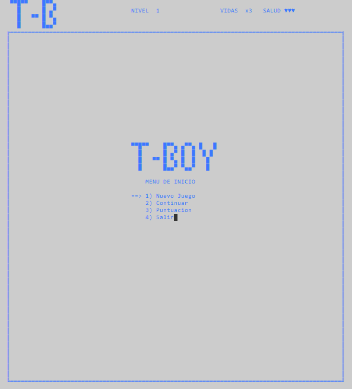
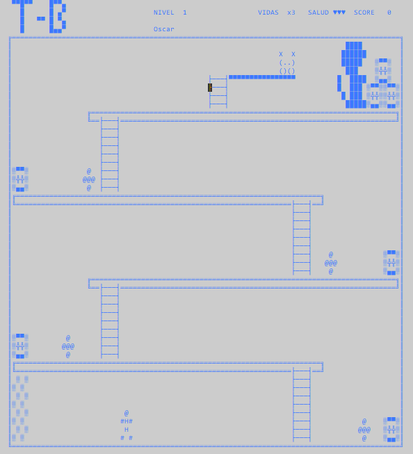

# T-Boy - Proyecto del Curso de Programacion I

Como parte del Curso de Programacion I de la Universidad, tuvimos la oportunidad de crear un pequeño videojuego en el lenguaje de programacion C++ haciendo uso de lo que aprendimos durante el curso, se trata de un juego de plataformas que debia contar con las siguientes carcteristicas:

### Caracteristicas 

- Juego de Plataforma
- Incluir Marcador
- Incluir Vidas
- Niveles
- Enemigos u Obstaculos
- Desarrollar en C++

## Screenshots

Menu Principal

Juego

## Construido con

- Lenguaje de Programación C++ 
- IDE Dev-C++
- Función Gotoxy
- Código ASCII

## Agradecimientos

Al ingeniero Axel Aguilar por su paciencia al impartir el curso y a mis compañeros de curso que aportaron lo que iban aprendiendo es sus proyectos.